# Dependency graph + wave ordering

**Phase 3 output.** Built from the `## Dependencies` section of each brief in `solutions/`. 39 capabilities total, 0 cycles detected. 4 waves.

## Wave ordering (topological sort)

Wave N contains capabilities whose blocked-by set is entirely in waves < N. Within a wave, ordering is by effort + risk (smaller + lower-risk first for quick wins).

### Wave 0 -- foundation + leaf fixes (14 capabilities)

No hard cross-capability blockers. Safe to parallelise across engineers. Strongly recommended "first 10 days" tranche.

| slug | effort | blocked-on-scope (Q#) |
|---|---|---|
| [new-sec-05-hsts-header](solutions/new-sec-05-hsts-header.md) | XS | none |
| [new-sec-01-appointment-route-permission-guard](solutions/new-sec-01-appointment-route-permission-guard.md) | XS-S | none |
| [new-sec-03-transactional-tenant-provisioning](solutions/new-sec-03-transactional-tenant-provisioning.md) | XS-S | none |
| [new-sec-02-method-level-authorize](solutions/new-sec-02-method-level-authorize.md) | S-M | none |
| [new-sec-04-external-signup-real-defaults](solutions/new-sec-04-external-signup-real-defaults.md) | S | none |
| [rest-api-parity-cleanup](solutions/rest-api-parity-cleanup.md) | S (doc-only + ADR-006) | Q28 (resolved static) |
| [lookup-data-seeds](solutions/lookup-data-seeds.md) | S | Q23 (answered in brief) |
| [internal-role-seeds](solutions/internal-role-seeds.md) | S (Q21=1) / S-M (Q21=3+Q22=no) / M (Q21=3+Q22=yes) | Q21, Q22 |
| [blob-storage-provider](solutions/blob-storage-provider.md) | M | Q17 (answered DB BLOB) |
| [email-sender-consumer](solutions/email-sender-consumer.md) | S-M | track-06 email Q (resolved SES-SMTP) |
| [background-jobs-infrastructure](solutions/background-jobs-infrastructure.md) | S-M | Q18 (answered Hangfire) |
| [system-parameters-vs-abp-settings](solutions/system-parameters-vs-abp-settings.md) | S | Q8 (answered ABP Settings) |
| [users-admin-management](solutions/users-admin-management.md) | S (verify only) | none |
| [patient-auto-match](solutions/patient-auto-match.md) | M | none; subsumes NEW-SEC-04 |

**Wave 0 effort roll-up:** 5 XS/XS-S + 6 S/S-M + 3 M = **~13-18 engineer-days** when parallelised.

### Wave 1 -- depends on Wave 0 (12 capabilities)

| slug | effort | blocked by | blocked-on-scope |
|---|---|---|---|
| [appointment-state-machine](solutions/appointment-state-machine.md) | M (~3d) | none strictly | Q5 |
| [appointment-lead-time-limits](solutions/appointment-lead-time-limits.md) | M | system-parameters-vs-abp-settings | indirect Q8 |
| [appointment-accessor-auto-provisioning](solutions/appointment-accessor-auto-provisioning.md) | L | email-sender-consumer, internal-role-seeds | Q22 |
| [account-self-service](solutions/account-self-service.md) | S | email-sender-consumer | Q16 |
| [templates-email-sms](solutions/templates-email-sms.md) | M | email-sender-consumer | Q7 |
| [appointment-full-field-snapshot](solutions/appointment-full-field-snapshot.md) | S-M | lookup-data-seeds, internal-role-seeds | none |
| [appointment-documents](solutions/appointment-documents.md) | L (~7d) | blob-storage-provider, lookup-data-seeds | indirect Q17 |
| [sms-sender-consumer](solutions/sms-sender-consumer.md) | 0 (defer) or M (port) | background-jobs-infrastructure | track-06 SMS Q (defer recommended) |
| [custom-fields](solutions/custom-fields.md) | S-M | lookup-data-seeds | Q6 |
| [user-query-contact-us](solutions/user-query-contact-us.md) | 0 (Q11=no) or S | none | Q11 |
| [document-packages](solutions/document-packages.md) | 0 (Q9=no) or M (Q9=yes) | blob-storage-provider, appointment-documents | Q9 |
| [attorney-defense-patient-separation](solutions/attorney-defense-patient-separation.md) | S-M (A) or M (B) | none | Q1, Q2 |
| [new-qual-01-critical-path-test-coverage](solutions/new-qual-01-critical-path-test-coverage.md) | M | logical: new-sec-02/03/04 fixes | none |

**Wave 1 effort roll-up:** assuming scope-clarifying answers lean minimal: 1 XS + 4 S/S-M + 4 M + 2 L = **~25-35 engineer-days** when parallelised.

### Wave 2 -- depends on Wave 1 (10 capabilities)

| slug | effort | blocked by |
|---|---|---|
| [appointment-booking-cascade](solutions/appointment-booking-cascade.md) | M | appointment-state-machine |
| [appointment-search-listview](solutions/appointment-search-listview.md) | S | lookup-data-seeds (W0), internal-role-seeds (W0) |
| [appointment-change-log-audit](solutions/appointment-change-log-audit.md) | S-M | internal-role-seeds (W0), appointment-state-machine (W1) |
| [appointment-injury-workflow](solutions/appointment-injury-workflow.md) | L (~7d) | lookup-data-seeds (W0) |
| [anonymous-document-upload](solutions/anonymous-document-upload.md) | L | appointment-documents, blob, email |
| [joint-declarations](solutions/joint-declarations.md) | M | blob, email, attorney-defense-patient-separation |
| [appointment-notes](solutions/appointment-notes.md) | S | appointment-accessor-auto-provisioning |
| [external-user-home](solutions/external-user-home.md) | S | internal-role-seeds, new-sec-04 |
| [scheduler-notifications](solutions/scheduler-notifications.md) | M (~3-4d) | background-jobs, email, templates, accessor |
| [dashboard-counters](solutions/dashboard-counters.md) | S-M | internal-role-seeds, appointment-state-machine |

**Wave 2 effort roll-up:** ~22-30 engineer-days.

### Wave 3 -- depends on Wave 2 (2 capabilities)

| slug | effort | blocked by |
|---|---|---|
| [appointment-change-requests](solutions/appointment-change-requests.md) | L (~7.5d) | appointment-state-machine (W1), appointment-booking-cascade (W2) |
| [appointment-request-report-export](solutions/appointment-request-report-export.md) | M | appointment-full-field-snapshot (W1), appointment-search-listview (W2), lookup-data-seeds (W0) |

**Wave 3 effort roll-up:** ~10-12 engineer-days.

## Mermaid graph

```mermaid
graph TD
  subgraph W0["Wave 0 foundation + leaf fixes"]
    SEC05[new-sec-05-hsts-header]
    SEC01[new-sec-01-appointment-route-permission-guard]
    SEC03[new-sec-03-transactional-tenant-provisioning]
    SEC02[new-sec-02-method-level-authorize]
    SEC04[new-sec-04-external-signup-real-defaults]
    APIP[rest-api-parity-cleanup]
    LS[lookup-data-seeds]
    IRS[internal-role-seeds]
    BLOB[blob-storage-provider]
    EMAIL[email-sender-consumer]
    BGJ[background-jobs-infrastructure]
    SYS[system-parameters-vs-abp-settings]
    UAM[users-admin-management]
    PAM[patient-auto-match]
  end

  subgraph W1["Wave 1"]
    SM[appointment-state-machine]
    LT[appointment-lead-time-limits]
    ACC[appointment-accessor-auto-provisioning]
    ACC_SS[account-self-service]
    TPL[templates-email-sms]
    FFS[appointment-full-field-snapshot]
    DOCS[appointment-documents]
    SMS[sms-sender-consumer]
    CF[custom-fields]
    UQ[user-query-contact-us]
    DPK[document-packages]
    ATY[attorney-defense-patient-separation]
    QUAL01[new-qual-01-critical-path-test-coverage]
  end

  subgraph W2["Wave 2"]
    BC[appointment-booking-cascade]
    SRC[appointment-search-listview]
    LOG[appointment-change-log-audit]
    INJ[appointment-injury-workflow]
    ANON[anonymous-document-upload]
    JD[joint-declarations]
    NOT[appointment-notes]
    EXH[external-user-home]
    SCH[scheduler-notifications]
    DC[dashboard-counters]
  end

  subgraph W3["Wave 3"]
    CR[appointment-change-requests]
    RPT[appointment-request-report-export]
  end

  SYS --> LT
  EMAIL --> ACC
  IRS --> ACC
  EMAIL --> ACC_SS
  EMAIL --> TPL
  LS --> FFS
  IRS --> FFS
  BLOB --> DOCS
  LS --> DOCS
  BGJ --> SMS
  LS --> CF
  BLOB --> DPK
  DOCS --> DPK
  SEC02 --> QUAL01
  SEC03 --> QUAL01
  SEC04 --> QUAL01

  SM --> BC
  LS --> SRC
  IRS --> SRC
  IRS --> LOG
  SM --> LOG
  LS --> INJ
  DOCS --> ANON
  BLOB --> ANON
  EMAIL --> ANON
  BLOB --> JD
  EMAIL --> JD
  ATY --> JD
  ACC --> NOT
  IRS --> EXH
  SEC04 --> EXH
  BGJ --> SCH
  EMAIL --> SCH
  TPL --> SCH
  ACC --> SCH
  IRS --> DC
  SM --> DC

  SM --> CR
  BC --> CR
  FFS --> RPT
  SRC --> RPT
  LS --> RPT

  PAM -.->|"subsumes fix"| SEC04
```

## Cycle audit

Run verification: every edge in the graph points forward in wave index; no back-edges. 0 cycles detected.

## Blocked-on-scope contingency

10 of 39 capabilities carry a `Blocked by open question` tag. Their wave position is STABLE if Adrian answers the default recommendation in each brief; it SHIFTS if he answers otherwise. Details routed to `blocked-on-scope.md`.

## Effort roll-up

- **Wave 0:** ~13-18 engineer-days (parallelisable across 4-6 engineers)
- **Wave 1:** ~25-35 engineer-days
- **Wave 2:** ~22-30 engineer-days
- **Wave 3:** ~10-12 engineer-days

**Grand total: 70-95 engineer-days MVP**, before scope-question answers shrink or expand it. Assumes 1 engineer (Adrian) working serially with some parallelisable PRs within waves: ~16-22 calendar weeks (4-5.5 months) at 100% allocation.

## Acknowledged soft edges

- `patient-auto-match` subsumes the fix for `new-sec-04-external-signup-real-defaults` (cleaner flow replaces hardcoded defaults). Coordinate to avoid merge collision.
- `new-qual-01-critical-path-test-coverage` is LOGICALLY blocked by `new-sec-02/03/04` but technically can land FIRST with tests encoding current-defective-behaviour (per `memory/feedback_encode_gaps_in_tests.md`). The fix PRs flip Skip / invert assertions.
- `rest-api-parity-cleanup` is documentation-only (ADR-006 + track-04 intentional-diffs); no code in this capability.
