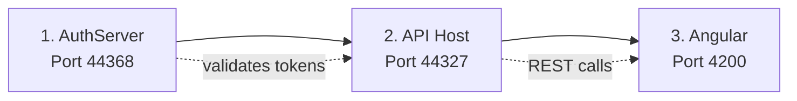

# Getting Started

[Home](../INDEX.md) > [Onboarding](./) > Getting Started

---

This guide takes you from a fresh clone to a running application. The Patient Portal is a workers' compensation IME scheduling system built with .NET 10, Angular 20, and ABP Commercial. It runs three services locally: an OAuth authentication server, a REST API, and an Angular single-page application.

For detailed configuration (connection strings, HTTPS certificates, Redis, ABP Studio profiles), see [Development Setup](../devops/DEVELOPMENT-SETUP.md).

## Prerequisites

| Tool | Version | How to Check | How to Install |
|------|---------|-------------|----------------|
| .NET SDK | 10.0 | `dotnet --version` | [dotnet.microsoft.com](https://dotnet.microsoft.com/download) |
| Node.js | LTS (22+) | `node --version` | [nodejs.org](https://nodejs.org/) |
| SQL Server | Any (LocalDB, Docker, or full) | See database setup below | See database setup below |
| Angular CLI | Latest | `ng version` | `npm install -g @angular/cli` |
| ABP CLI | Latest | `abp --version` | `dotnet tool install -g Volo.Abp.Studio.Cli` |

Optional: Redis (disabled by default), Docker Desktop.

## Step 1: Clone and Position

```bash
git clone <repository-url>
cd hcs-case-evaluation-portal
```

> **Windows path length note:** .NET native DLLs can fail to load if the project path exceeds ~200 characters. Clone to a short path (e.g., `C:\Dev\hcs-portal` or use `subst` to create a drive alias). On macOS/Linux this is not an issue. See [Troubleshooting](#deep-dive-windows-path-length) for details.

## Step 2: Install Dependencies

```bash
# Backend (.NET packages)
dotnet restore

# Frontend (Angular packages)
cd angular
npm install
cd ..
```

The `npm install` step downloads ~1GB of Angular + ABP packages. `ERESOLVE` warnings are typically safe to ignore for ABP projects.

## Step 3: Database Setup

The application needs a SQL Server instance. Choose one option:

### Option A: Docker (recommended, cross-platform)
```bash
# If you have Docker installed:
docker run -e "ACCEPT_EULA=Y" -e "SA_PASSWORD=YourStrong!Passw0rd" \
  -p 1433:1433 --name sql-server -d mcr.microsoft.com/mssql/server:2022-latest
```
Then update `ConnectionStrings:Default` in `src/*/appsettings.json` to use `Server=localhost;...`.

### Option B: SQL Server LocalDB (Windows only)
```bash
sqllocaldb start MSSQLLocalDB
```
The default connection strings already point to LocalDB — no config changes needed.

### Option C: Full SQL Server
Point the connection strings in `src/*/appsettings.json` to your SQL Server instance.

### Run Migrations
```bash
dotnet run --project src/HealthcareSupport.CaseEvaluation.DbMigrator
```

This creates the database, applies all migrations, and seeds initial data (admin user, OAuth clients, permissions).

**Default admin credentials:** `admin@abp.io` / see `TEST_PASSWORD` in `.env.local`

## Step 4: Trust HTTPS Certificates

```bash
dotnet dev-certs https --trust
```

## Step 5: Start the Application

The three services must start in this exact order:



**Terminal 1 -- AuthServer** (start first):
```bash
dotnet run --project src/HealthcareSupport.CaseEvaluation.AuthServer
```
Wait for `Now listening on: https://localhost:44368`.

**Terminal 2 -- API Host** (start after AuthServer is ready):
```bash
dotnet run --project src/HealthcareSupport.CaseEvaluation.HttpApi.Host
```
Wait for `Now listening on: https://localhost:44327`.

**Terminal 3 -- Angular** (start last):
```bash
cd angular
npx ng build --configuration development
npx serve -s dist/CaseEvaluation/browser -p 4200
```

> **Critical:** Never use `ng serve` or `yarn start`. Angular 20's Vite pre-bundler creates duplicate `InjectionToken` instances, causing `NullInjectorError: CORE_OPTIONS`. The `ng build` + `npx serve` approach avoids this. See [Deep Dive](#deep-dive-why-ng-serve-breaks) below.

## Step 6: Verify Everything Works

```bash
# AuthServer -- should return 200
curl -sk -o /dev/null -w "%{http_code}" https://localhost:44368/.well-known/openid-configuration

# API Host -- should return 200
curl -sk -o /dev/null -w "%{http_code}" https://localhost:44327/swagger/index.html

# Angular -- should return 200
curl -s -o /dev/null -w "%{http_code}" http://localhost:4200/
```

Open **http://localhost:4200**, log in with `admin@abp.io` and the `TEST_PASSWORD` from your `.env.local`. You should see the LeptonX dashboard with sidebar menu (Appointments, Doctors, Patients, Locations).

| Service | URL | Expected |
|---------|-----|----------|
| AuthServer | https://localhost:44368 | OpenIddict login page |
| API Host | https://localhost:44327/swagger | Swagger API explorer |
| Angular | http://localhost:4200 | LeptonX themed SPA |

## Troubleshooting

| Problem | Cause | Solution |
|---------|-------|----------|
| `NullInjectorError: CORE_OPTIONS` | Used `ng serve` instead of `ng build` + `npx serve` | Kill any running Angular processes, rebuild with `npx ng build --configuration development`, serve with `npx serve` |
| CORE_OPTIONS persists after rebuild | Ghost dev server still on port 4200 | Check `lsof -i :4200` (macOS/Linux) or `netstat -ano | findstr :4200` (Windows), kill the process, then restart |
| `OIDC configuration error` from API Host | AuthServer not running or not ready | Start AuthServer first, wait for "listening" message |
| `HTTP 500` on API requests (Windows) | Project path exceeds 260 chars | Move project to a shorter path. See [path length note](#deep-dive-windows-path-length) |
| SQL connection error on startup | Database server not running | Start your SQL Server (Docker: `docker start sql-server`, LocalDB: `sqllocaldb start MSSQLLocalDB`) |
| SSL certificate errors in browser | Dev cert not trusted | Run `dotnet dev-certs https --trust` |
| Port already in use | Previous instance still running | Find and kill: `lsof -i :44327` (macOS/Linux) or `netstat -ano | findstr :44327` (Windows) |
| Angular build fails with ABP library errors | ABP client-side libs not installed | Run `abp install-libs` from the solution root |
| `Host version X does not match binary Y` (esbuild) | Stale esbuild binary | Delete `node_modules/@esbuild/*/esbuild*`, re-run `npm install` |
| Migration error: "database already exists" | Partial previous run | Drop the `CaseEvaluation` database and re-run DbMigrator |

---

## Deep Dives

### Deep Dive: Windows Path Length

On Windows, .NET native DLLs (like `Microsoft.Data.SqlClient.SNI.dll`) are loaded by `LoadLibrary`, which enforces a 260-character path limit regardless of the `LongPathsEnabled` registry setting. If your project is deeply nested (e.g., `C:\Users\YourName\Documents\Projects\Long Folder Name\hcs-case-evaluation-portal`), the build output paths can exceed this limit, causing HTTP 500 on every API request.

**Fix:** Clone to a short path like `C:\Dev\portal` or use Windows drive substitution (`subst X: "C:\Your\Long\Path"`). This is a Windows-only issue — macOS and Linux are not affected.

### Deep Dive: Why `ng serve` Breaks

Angular 20's dev server uses Vite's `optimizeDeps` pre-bundler, which splits `@abp/ng.core` across two JS chunks. Each chunk creates its own `new InjectionToken("CORE_OPTIONS")`. Angular DI uses `===` identity, so the provider (token A from chunk 1) never matches the injection (token B from chunk 2). The `ng build` output (esbuild, no Vite) produces exactly one token instance, so the build works correctly. This is a Vite behavior, not a code bug.

---

## Advanced Configuration

### Configuration Files

| File | Purpose | Key Settings |
|------|---------|-------------|
| `src/.../HttpApi.Host/appsettings.json` | API configuration | `App:SelfUrl`, `AuthServer:Authority`, CORS origins |
| `src/.../AuthServer/appsettings.json` | Auth server config | `App:SelfUrl`, redirect URLs, signing cert |
| `src/.../DbMigrator/appsettings.json` | Database + seeding | Connection string, OAuth client registration |
| `angular/src/environments/environment.ts` | Frontend config | API URL, OAuth client ID |

### Redis (Optional)

Redis is disabled by default. Only needed for multi-instance deployment. Set `Redis:IsEnabled` to `true` in appsettings.json and run Redis on port 6379.

---

**Next steps:**
- [Common Tasks](COMMON-TASKS.md) -- add entities, run migrations, create tests
- [Architecture Overview](../architecture/OVERVIEW.md) -- understand the system structure
- [Docker & Deployment](../runbooks/DOCKER-DEV.md) -- containerization
- [Testing Strategy](../devops/TESTING-STRATEGY.md) -- running and writing tests
