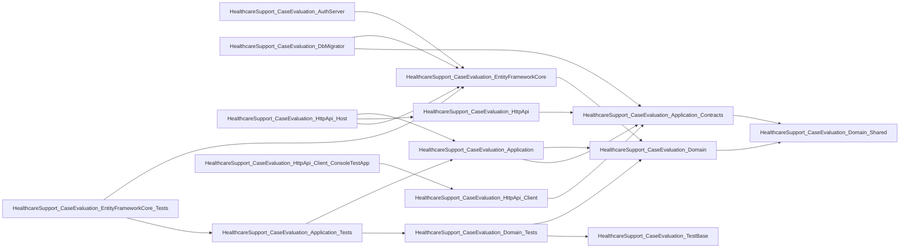

[Home](../INDEX.md) > Repository Map

# Repository Map

> Auto-generated by `.claude/scripts/build-repo-map.py`. Regenerate after significant structural changes. For instructions, see [README](README.md).

**Generated:** 2026-04-13T16:17:41+00:00

## Stacks Detected

- **.NET / ABP Framework 10.0.2** (371 files) -- Detected via .csproj files
- **Angular 20 (standalone components)** (128 files) -- Detected via angular/src/app

## .NET Projects

| Project | References |
|---|---|
| `src/HealthcareSupport.CaseEvaluation.Application.Contracts/HealthcareSupport.CaseEvaluation.Application.Contracts.csproj` | HealthcareSupport.CaseEvaluation.Domain.Shared |
| `src/HealthcareSupport.CaseEvaluation.Application/HealthcareSupport.CaseEvaluation.Application.csproj` | HealthcareSupport.CaseEvaluation.Domain, HealthcareSupport.CaseEvaluation.Application.Contracts |
| `src/HealthcareSupport.CaseEvaluation.AuthServer/HealthcareSupport.CaseEvaluation.AuthServer.csproj` | HealthcareSupport.CaseEvaluation.EntityFrameworkCore |
| `src/HealthcareSupport.CaseEvaluation.DbMigrator/HealthcareSupport.CaseEvaluation.DbMigrator.csproj` | HealthcareSupport.CaseEvaluation.EntityFrameworkCore, HealthcareSupport.CaseEvaluation.Application.Contracts |
| `src/HealthcareSupport.CaseEvaluation.Domain.Shared/HealthcareSupport.CaseEvaluation.Domain.Shared.csproj` | (none) |
| `src/HealthcareSupport.CaseEvaluation.Domain/HealthcareSupport.CaseEvaluation.Domain.csproj` | HealthcareSupport.CaseEvaluation.Domain.Shared |
| `src/HealthcareSupport.CaseEvaluation.EntityFrameworkCore/HealthcareSupport.CaseEvaluation.EntityFrameworkCore.csproj` | HealthcareSupport.CaseEvaluation.Domain |
| `src/HealthcareSupport.CaseEvaluation.HttpApi.Client/HealthcareSupport.CaseEvaluation.HttpApi.Client.csproj` | HealthcareSupport.CaseEvaluation.Application.Contracts |
| `src/HealthcareSupport.CaseEvaluation.HttpApi.Host/HealthcareSupport.CaseEvaluation.HttpApi.Host.csproj` | HealthcareSupport.CaseEvaluation.Application, HealthcareSupport.CaseEvaluation.HttpApi, HealthcareSupport.CaseEvaluation.EntityFrameworkCore |
| `src/HealthcareSupport.CaseEvaluation.HttpApi/HealthcareSupport.CaseEvaluation.HttpApi.csproj` | HealthcareSupport.CaseEvaluation.Application.Contracts |
| `test/HealthcareSupport.CaseEvaluation.Application.Tests/HealthcareSupport.CaseEvaluation.Application.Tests.csproj` | HealthcareSupport.CaseEvaluation.Application, HealthcareSupport.CaseEvaluation.Domain.Tests |
| `test/HealthcareSupport.CaseEvaluation.Domain.Tests/HealthcareSupport.CaseEvaluation.Domain.Tests.csproj` | HealthcareSupport.CaseEvaluation.Domain, HealthcareSupport.CaseEvaluation.TestBase |
| `test/HealthcareSupport.CaseEvaluation.EntityFrameworkCore.Tests/HealthcareSupport.CaseEvaluation.EntityFrameworkCore.Tests.csproj` | HealthcareSupport.CaseEvaluation.EntityFrameworkCore, HealthcareSupport.CaseEvaluation.Application.Tests |
| `test/HealthcareSupport.CaseEvaluation.HttpApi.Client.ConsoleTestApp/HealthcareSupport.CaseEvaluation.HttpApi.Client.ConsoleTestApp.csproj` | HealthcareSupport.CaseEvaluation.HttpApi.Client |
| `test/HealthcareSupport.CaseEvaluation.TestBase/HealthcareSupport.CaseEvaluation.TestBase.csproj` | (none) |

## Project Dependency Graph

## Top 15 Most-Referenced C# Files

Files with the highest in-degree -- these are the most load-bearing pieces of the codebase.

| Rank | In-degree | File |
|---|---|---|
| 1 | 51 | `src/HealthcareSupport.CaseEvaluation.EntityFrameworkCore/EntityFrameworkCore/CaseEvaluationDbContext.cs` |
| 2 | 51 | `src/HealthcareSupport.CaseEvaluation.EntityFrameworkCore/EntityFrameworkCore/CaseEvaluationDbContextBase.cs` |
| 3 | 51 | `src/HealthcareSupport.CaseEvaluation.EntityFrameworkCore/EntityFrameworkCore/CaseEvaluationDbContextFactory.cs` |
| 4 | 51 | `src/HealthcareSupport.CaseEvaluation.EntityFrameworkCore/EntityFrameworkCore/CaseEvaluationDbContextFactoryBase.cs` |
| 5 | 51 | `src/HealthcareSupport.CaseEvaluation.EntityFrameworkCore/EntityFrameworkCore/CaseEvaluationEfCoreEntityExtensionMappings.cs` |
| 6 | 51 | `src/HealthcareSupport.CaseEvaluation.EntityFrameworkCore/EntityFrameworkCore/CaseEvaluationEntityFrameworkCoreModule.cs` |
| 7 | 51 | `src/HealthcareSupport.CaseEvaluation.EntityFrameworkCore/EntityFrameworkCore/CaseEvaluationTenantDbContext.cs` |
| 8 | 51 | `src/HealthcareSupport.CaseEvaluation.EntityFrameworkCore/EntityFrameworkCore/CaseEvaluationTenantDbContextFactory.cs` |
| 9 | 51 | `src/HealthcareSupport.CaseEvaluation.EntityFrameworkCore/EntityFrameworkCore/EntityFrameworkCoreCaseEvaluationDbSchemaMigrator.cs` |
| 10 | 51 | `test/HealthcareSupport.CaseEvaluation.EntityFrameworkCore.Tests/EntityFrameworkCore/CaseEvaluationEntityFrameworkCoreCollection.cs` |
| 11 | 51 | `test/HealthcareSupport.CaseEvaluation.EntityFrameworkCore.Tests/EntityFrameworkCore/CaseEvaluationEntityFrameworkCoreFixture.cs` |
| 12 | 51 | `test/HealthcareSupport.CaseEvaluation.EntityFrameworkCore.Tests/EntityFrameworkCore/CaseEvaluationEntityFrameworkCoreTestBase.cs` |
| 13 | 51 | `test/HealthcareSupport.CaseEvaluation.EntityFrameworkCore.Tests/EntityFrameworkCore/CaseEvaluationEntityFrameworkCoreTestModule.cs` |
| 14 | 50 | `test/HealthcareSupport.CaseEvaluation.EntityFrameworkCore.Tests/EntityFrameworkCore/CaseEvaluationEntityFrameworkCoreCollectionFixtureBase.cs` |
| 15 | 48 | `src/HealthcareSupport.CaseEvaluation.Domain.Shared/Enums/AccessType.cs` |

## Top 15 Most-Imported Angular Files

| Rank | In-degree | File |
|---|---|---|
| 1 | 1 | `angular/src/app/applicant-attorneys/applicant-attorney/applicant-attorney-routes.ts` |
| 2 | 1 | `angular/src/app/appointment-languages/appointment-language/appointment-language-routes.ts` |
| 3 | 1 | `angular/src/app/appointment-statuses/appointment-status/appointment-status-routes.ts` |
| 4 | 1 | `angular/src/app/appointment-types/appointment-type/appointment-type-routes.ts` |
| 5 | 1 | `angular/src/app/appointments/appointment/appointment-routes.ts` |
| 6 | 1 | `angular/src/app/doctor-availabilities/doctor-availability/doctor-availability-routes.ts` |
| 7 | 1 | `angular/src/app/doctors/doctor/doctor-routes.ts` |
| 8 | 1 | `angular/src/app/locations/location/location-routes.ts` |
| 9 | 1 | `angular/src/app/patients/patient/patient-routes.ts` |
| 10 | 1 | `angular/src/app/states/state/state-routes.ts` |
| 11 | 1 | `angular/src/app/wcab-offices/wcab-office/wcab-office-routes.ts` |

## Summary Statistics

- C# files scanned: **371**
- C# public symbols: **390**
- TypeScript files scanned: **128**
- TypeScript exported symbols: **118**
- .NET projects: **15**

## Commands

- **build (dotnet):** `dotnet build HealthcareSupport.CaseEvaluation.slnx`
- **test (dotnet):** `dotnet test`
- **migrate DB:** `dotnet run --project src/HealthcareSupport.CaseEvaluation.DbMigrator`
- **build (angular):** `cd angular && npx ng build --configuration development`
- **serve (angular):** `cd angular && npx serve -s dist/CaseEvaluation/browser -p 4200`
