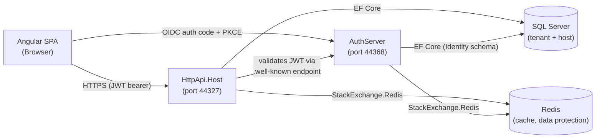

[Home](../INDEX.md) > Security > Threat Model

# Threat Model

> For known security vulnerabilities and remediation status, see [Security Issues](../issues/SECURITY.md).

STRIDE-based threat model for the four main components of the CaseEvaluation Patient Portal. This document describes the security architecture; it does not list specific bugs (see linked issue file for that).

**Last verified:** 2026-04-13
**Method:** code-inspect + existing SECURITY.md findings

---

## Trust Boundaries

Each arrow crosses a trust boundary. Data flowing across these lines must be authenticated, authorized, and validated.

---

## Component 1: Angular SPA (browser)

**Assets at risk:** Access tokens, refresh tokens, session cookies, PHI rendered in UI.

| STRIDE | Threat | Existing Mitigation | Gap |
|---|---|---|---|
| Spoofing | Phishing clone capturing user credentials | OIDC flow via AuthServer (not SPA-hosted login) | No brand protection / no user education materials |
| Tampering | Malicious browser extension modifying DOM to exfiltrate PHI | None at application layer | Browser-level threat; outside app control |
| Repudiation | User denies submitting appointment | ABP audit logs record Create/Update operations | Log retention policy undocumented |
| Information Disclosure | XSS injecting script that reads token from storage | Angular sanitizes bindings by default; no `innerHTML` in feature modules | Token storage location (localStorage vs httpOnly cookie) needs verification |
| Denial of Service | Malicious input crashing browser tab | Angular input validation via Reactive Forms | Not a significant threat to server |
| Elevation of Privilege | User bypasses UI-based permission guards | Server re-validates every permission (ABP `[Authorize(Permission)]`) | UI-only enforcement would be a bug; server must always verify |

---

## Component 2: HttpApi.Host (port 44327)

**Assets at risk:** PHI in transit and in responses, JWT validation keys, database connection string.

| STRIDE | Threat | Existing Mitigation | Gap |
|---|---|---|---|
| Spoofing | Forged JWT with elevated claims | JWT signature validated against AuthServer public keys via `.well-known/jwks` | Key rotation process undocumented |
| Tampering | SQL injection via query parameters | EF Core parameterizes queries; no raw SQL in repositories | Dynamic LINQ in filter endpoints should be reviewed |
| Repudiation | Action attribution loss after admin edits record | ABP audit logging (`IAbpSession.UserId` captured) | Audit log retention and tamper-evidence not configured |
| Information Disclosure | PHI leakage via error messages, logs, or over-broad responses | Development exception page disabled in production builds | SEC-02 (PII logging enabled by default) is an active high-severity gap |
| Denial of Service | Unauthenticated endpoint flooded | Endpoints require auth by default (ABP convention) | No rate limiting configured |
| Elevation of Privilege | Missing authorization attribute on AppService method | Every AppService method has explicit or inherited `[Authorize]` | Manual verification required -- no automated check |

---

## Component 3: AuthServer (port 44368)

**Assets at risk:** User credentials, OpenIddict signing certificate, refresh token vault.

| STRIDE | Threat | Existing Mitigation | Gap |
|---|---|---|---|
| Spoofing | Stolen password used to log in | ABP Identity enforces password complexity; 2FA available via ABP Identity module | 2FA not mandatory for admin roles |
| Tampering | Forged auth code in OIDC flow | PKCE enforced on authorization code flow | None identified |
| Repudiation | User denies issuing a token | OpenIddict stores token issuance records in DB | Retention period undocumented |
| Information Disclosure | Signing certificate private key exposure | PFX password in `appsettings.Local.json` (gitignored) | SEC-01 historical exposure (pre-remediation) -- requires cert rotation |
| Denial of Service | Brute force login attempts | ABP Identity lockout after N failures | Lockout policy values not audited |
| Elevation of Privilege | Privilege escalation via IdentityServer misconfig | OpenIddict default scopes + explicit role-to-permission mapping | Role elevation auditing not configured |

---

## Component 4: SQL Server (database)

**Assets at risk:** All PHI at rest, tenant isolation data, audit logs, identity records.

| STRIDE | Threat | Existing Mitigation | Gap |
|---|---|---|---|
| Spoofing | Connection from unauthorized host | Connection string with password; Docker network isolation | No TLS on intra-service DB connections (dev only; prod unverified) |
| Tampering | Direct DB modification bypassing audit | DB user has full write access (ABP pattern) | No DB-level row-level audit; relies on app-layer audit |
| Repudiation | DBA actions not attributed | SQL Server audit available but unconfigured | Gap: enable SQL Server audit in production |
| Information Disclosure | Backup or snapshot with unencrypted PHI | No encryption at rest configured | Gap: TDE (Transparent Data Encryption) not enabled |
| Denial of Service | Runaway query locks tables | ABP uses EF Core with default isolation | No query timeout enforcement at DB layer |
| Elevation of Privilege | App user granted excessive SQL permissions | Single app user (sa/admin in dev) | Gap: least-privilege DB user for production |

**Multi-tenancy integrity:** ABP's `IMultiTenant` data filter automatically scopes queries by `TenantId`. However, the `Patient` entity has a `TenantId` property but does **not** implement `IMultiTenant` (see [Patient CLAUDE.md](../../src/HealthcareSupport.CaseEvaluation.Domain/Patients/CLAUDE.md)), so Patient queries are not automatically tenant-filtered. Any code that queries `Patient` must manually filter by `TenantId` to prevent cross-tenant PHI disclosure.

---

## Summary of Active Gaps

Ordered by severity (cross-reference [Security Issues](../issues/SECURITY.md) for remediation tracking):

1. **SEC-02 (High):** PII logging enabled by default in `CaseEvaluationHttpApiHostModule.cs` -- fix the config default.
2. **Patient tenant filter gap (High):** Patient entity lacks `IMultiTenant` -- manual filtering required on every query.
3. **Signing cert rotation (High):** Post-SEC-01 rotation required if cert was ever in git history.
4. **TDE / encryption at rest (Medium):** Not configured. Required for HIPAA in most cloud deployments.
5. **Rate limiting (Medium):** No rate limiting on API endpoints.
6. **2FA enforcement (Medium):** 2FA available but not required for admin roles.
7. **Audit log retention policy (Low):** No documented retention policy.
8. **DB least-privilege user (Low):** Production DB user scope undocumented.
