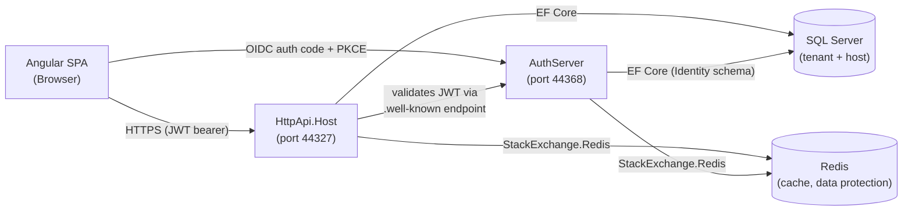

[Home](../INDEX.md) > Security > Threat Model

# Threat Model

> Purpose: STRIDE-based threat model for the four main portal components. Audience: security reviewer, engineering lead.

> For known security vulnerabilities and remediation status, see the security issues backlog.

STRIDE-based threat model for the four main components of the CaseEvaluation Appointment Portal. This document describes the security architecture; it does not list specific bugs (see linked issue file for that).

**Last verified:** 2026-06-01
**Method:** code-inspect + existing SECURITY.md findings

---

## Trust Boundaries

```mermaid
flowchart LR
    Browser["Angular SPA<br/>(Browser)"]
    API["HttpApi.Host<br/>(port 44327)"]
    Auth["AuthServer<br/>(port 44368)"]
    DB[("SQL Server<br/>(tenant + host)")]
    Redis[("Redis<br/>(cache, data protection)")]

    Browser -- "HTTPS (JWT bearer)" --> API
    Browser -- "OIDC auth code + PKCE" --> Auth
    API -- "validates JWT via<br/>.well-known endpoint" --> Auth
    API -- "EF Core" --> DB
    Auth -- "EF Core (Identity schema)" --> DB
    API -- "StackExchange.Redis" --> Redis
    Auth -- "StackExchange.Redis" --> Redis
```

Each arrow crosses a trust boundary. Data flowing across these lines must be authenticated, authorized, and validated.

---

## Component 1: Angular SPA (browser)

**Assets at risk:** Access tokens, refresh tokens, session cookies, PHI rendered in UI.

| STRIDE | Threat | Existing Mitigation | Gap |
|---|---|---|---|
| Spoofing | Phishing clone capturing user credentials | OIDC flow via AuthServer (not SPA-hosted login) | No brand protection / no user education materials |
| Tampering | Malicious browser extension modifying DOM to exfiltrate PHI | None at application layer | Browser-level threat; outside app control |
| Repudiation | User denies submitting appointment | ABP audit logs record Create/Update operations | Log retention policy undocumented |
| Information Disclosure | XSS injecting script that reads token from storage | Angular sanitizes bindings by default; no `innerHTML` in feature modules | Token storage location (localStorage vs httpOnly cookie) needs verification |
| Denial of Service | Malicious input crashing browser tab | Angular input validation via Reactive Forms | Not a significant threat to server |
| Elevation of Privilege | User bypasses UI-based permission guards | Server re-validates every permission (ABP `[Authorize(Permission)]`) | UI-only enforcement would be a bug; server must always verify |

---

## Component 2: HttpApi.Host (port 44327)

**Assets at risk:** PHI in transit and in responses, JWT validation keys, database connection string.

| STRIDE | Threat | Existing Mitigation | Gap |
|---|---|---|---|
| Spoofing | Forged JWT with elevated claims | JWT signature validated against AuthServer public keys via `.well-known/jwks` | Key rotation process undocumented |
| Tampering | SQL injection via query parameters | EF Core parameterises queries. Raw SQL DOES exist -- 5 `SqlQueryRaw` calls in `EfCoreCaseTrackerFeedStore` and one `ExecuteSqlRawAsync` (`sp_getapplock`) in `EfCoreIntegrationOutboxRepository` -- and every one passes values as `SqlParameter`, never string concatenation | Dynamic LINQ in filter endpoints should be reviewed. The raw SQL is parameterised today; a future edit that interpolates a value would not be caught by any check |
| Repudiation | Action attribution loss after admin edits record | ABP audit logging (`IAbpSession.UserId` captured) | Audit log retention and tamper-evidence not configured |
| Information Disclosure | PHI leakage via error messages, logs, or over-broad responses | Development exception page disabled in production builds | SEC-02 (PII logging enabled by default) is an active high-severity gap |
| Denial of Service | Unauthenticated endpoint flooded | ASP.NET rate limiting IS configured, with fixed-window partitions over password reset, signup, document upload, the integration surface and the consent endpoints (permit limits 5, 10, 15 and an hourly integration cap). There is **no** authorization fallback policy: the only `AddDefaultPolicy` in the host configures CORS | Limits are per-instance, not distributed, so they weaken if the API is scaled out |
| Elevation of Privilege | Missing authorization attribute on AppService method | An automated check exists: `AuthorizationSurfaceInvariantTests` over the generated `authorization-surface.approved.txt` (358 entries) asserts every method declares some authorization, that anonymous methods are on a justified allow-list, and that the surface exceeds 200 entries so it cannot pass vacuously | **The check does not distinguish authentication from authorisation.** A bare `[Authorize]` satisfies it. 181 methods sit behind a bare class-level `[Authorize]` and **20 carry no permission at all**. Two of those are the subject of an open draft advisory |

---

## Component 3: AuthServer (port 44368)

**Assets at risk:** User credentials, OpenIddict signing certificate, refresh token vault.

| STRIDE | Threat | Existing Mitigation | Gap |
|---|---|---|---|
| Spoofing | Stolen password used to log in | ABP Identity enforces password complexity; 2FA available via ABP Identity module | 2FA not mandatory for admin roles |
| Tampering | Forged auth code in OIDC flow | PKCE enforced on authorization code flow | None identified |
| Repudiation | User denies issuing a token | OpenIddict stores token issuance records in DB | Retention period undocumented |
| Information Disclosure | Signing certificate private key exposure | PFX password in `appsettings.Local.json` (gitignored) | SEC-01 historical exposure (pre-remediation) -- requires cert rotation |
| Denial of Service | Brute force login attempts | ABP Identity lockout after N failures | Lockout policy values not audited |
| Elevation of Privilege | Privilege escalation via IdentityServer misconfig | OpenIddict default scopes + explicit role-to-permission mapping | Role elevation auditing not configured |

---

## Component 4: SQL Server (database)

**Assets at risk:** All PHI at rest, tenant isolation data, audit logs, identity records.

| STRIDE | Threat | Existing Mitigation | Gap |
|---|---|---|---|
| Spoofing | Connection from unauthorized host | Connection string with password; Docker network isolation | No TLS on intra-service DB connections (dev only; prod unverified) |
| Tampering | Direct DB modification bypassing audit | DB user has full write access (ABP pattern) | No DB-level row-level audit; relies on app-layer audit |
| Repudiation | DBA actions not attributed | SQL Server audit available but unconfigured | Gap: enable SQL Server audit in production |
| Information Disclosure | Backup or snapshot with unencrypted PHI | No encryption at rest configured | Gap: TDE (Transparent Data Encryption) not enabled |
| Denial of Service | Runaway query locks tables | ABP uses EF Core with default isolation | No query timeout enforcement at DB layer |
| Elevation of Privilege | App user granted excessive SQL permissions | **None. The deployed stack connects as `sa`.** All three application services in `docker-compose.prod.yml` use `User Id=sa` (lines 204, 254, 321). The parenthetical "in dev" in the previous version of this row was wrong | Gap: a least-privilege database user. Note this is not merely hygiene here: under database-per-office the application creates databases, so the account needs elevated rights, and separating "may create an office database" from "may read every office's data" is the actual design work |

**Multi-tenancy integrity:** the primary boundary is **physical, not a filter.** Each office has
its own database, so a query on an office connection cannot reach another office's rows at all.
ABP's `IMultiTenant` filter is defence in depth on top of that, and 45 of 53 entity classes carry
it.

Host and IT-Admin paths that must read across offices disable the filter explicitly. That is not a
single sanctioned exception: there are **12 call sites across 3 services** (`PatientsAppService`
10, `DoctorsAppService` 1, `InternalUsersAppService` 1), because in host context
`CurrentTenant.Id` is null and the filter generates `WHERE TenantId IS NULL`, which excludes every
office's rows rather than including them.

The control that actually prevents a caller choosing an office is the resolver chain:
`TenantResolvers.Clear()` removes ABP's QueryString, Cookie, Header and Route contributors, so a
`__tenant` value in a request is inert. See
[architecture/TENANCY-AND-ISOLATION.md](../architecture/TENANCY-AND-ISOLATION.md).

---

## Summary of Active Gaps

Ordered by severity (cross-reference the security issues backlog for remediation tracking):

1. **SEC-02 (High):** PII logging enabled by default in `CaseEvaluationHttpApiHostModule.cs` -- fix the config default.
2. **Signing cert rotation (High):** Post-SEC-01 rotation required if cert was ever in git history.
3. **TDE / encryption at rest (Medium):** Not configured. Required for HIPAA in most cloud deployments.
4. **Rate limiting (Medium):** No rate limiting on API endpoints.
5. **2FA enforcement (Medium):** 2FA available but not required for admin roles.
6. **Audit log retention policy (Low):** No documented retention policy.
7. **DB least-privilege user (Low):** Production DB user scope undocumented.

**Resolved:** Patient tenant filter gap -- `Patient` now implements `IMultiTenant` (FEAT-09, 2026-05-05); ABP automatic filter handles tenant scoping.
